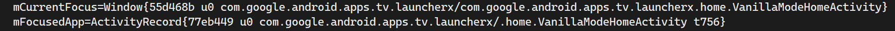
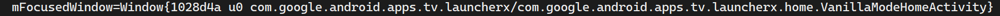
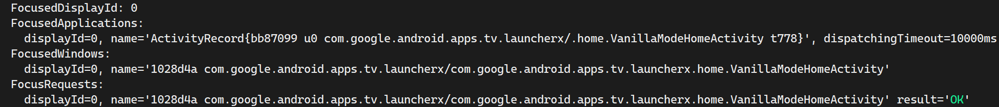
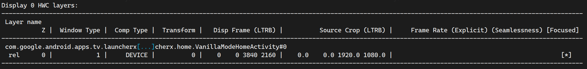

[toc]

# Android Window Focus 管理机制

## 简介

现代图形用户界面（GUI）系统通常以窗口为核心组织用户界面，GUI 系统中的 "focus" 是指用户界面中的一个特定部分（通常是一个**窗口（Window）**或**控件 （View）**）当前处于活动状态，并且可以接收来自键盘、鼠标、遥控或其他输入设备的用户输入，我们常说的某个窗口或某个空间有焦点的含义也是如此。

比如我们在 Windows 上工作时，按下键盘，只有当前有焦点的窗口或**控件**会接受按键，我们也可以使用鼠标或者 CRTL+Tab 切换窗口，使用 Tab 键让切换焦点到不同的空间。Android 平台一样，我们在使用 Android TV 时，按下遥控器，只有当前有焦点的窗口会接受处理按键，当我们按退出一个应用或者打开一个应用，或者按上下左右键时，焦点也会相应地进行变化。


本文主要讨论 Android Window Focus 管理机制，暂不涉及 window 内的控件(view)的焦点管理，涉及的代码为 以 Android S 代码。第二节先讨论了那几个模块都维护了 focus 信息，如何查询，各自有什么区别。第三四节，主要讨论 wm 模块和input 模块 focused window 和 focused application 变更流程，最后一节做简要总结

## Focus 相关模块

Android  GUI 系统主要有 WM 、Input 和 SurfaceFligner 维护 focus 信息。当 GUI 的窗口系统 window tree 发生变化时，WM 就会更新 focused window，当有新的 activity 时 resume 时会更新 focused app。WM 的 focused app 更新后会直接同步给 Input，而 focused window 更新后 则经 SurfaceFlinger 向 input 发起变更 focused window 的请求，input 模块会自行确定是否更新 focused window。只有 input 模块的 focused window 才会真正影响 keyevent 的分发。SF 中，如果一个 windo 有 focus 那么它在 SF选择帧率时 的影响就比较大。




| 模块  | Focus                  | 变更入口                     | 变更时机                                                 | 作用                  |
| ----- | ---------------------- | ---------------------------- | -------------------------------------------------------- | --------------------- |
| WM    | DC.mCurrentFocus       | DC.updateFocusedWindowLocked | window tree 发生变化                                     | \                     |
| WM    | DC.mFocusedApp         | DC.setFocusedApp             | 有新的 Activity 准备 resume 时                           | \                     |
| Input | focused window         | FR::setFocusedWindow         | 由 WMS 发起 request，由 FR 决定是否满足 request 进行更新 | 决定 key event 的分发 |
| Input | focused application    | ID::setFocusedApplication    | 与 DC.mFocusedApp 保持一致                               | \                     |
| SF    | dumpsys SurfaceFlinger | \                            | \                                                        | 影响 SF 帧率选择      |

通常是 AMS.setResumedActivityUncheckLocked 调用 DC.setFocusedApp

### WindowManager

执行 dumpsys window displays 可以查询 focus 信息



```java
// DisplayContent.java
class DisplayContent extends RootDisplayArea implements WindowManagerPolicy.DisplayContentInfo {
    // focused window
    WindowState mCurrentFocus;
    // focused application
    ActivityRecord mFocusedApp;
    
// 变更 focused window 的入口
    /**
     * Update the focused window and make some adjustments if the focus has changed.
     *
     * @param mode Indicates the situation we are in. Possible modes are:
     *             {@link WindowManagerService#UPDATE_FOCUS_NORMAL},
     *             {@link WindowManagerService#UPDATE_FOCUS_PLACING_SURFACES},
     *             {@link WindowManagerService#UPDATE_FOCUS_WILL_PLACE_SURFACES},
     *             {@link WindowManagerService#UPDATE_FOCUS_REMOVING_FOCUS}
     * @param updateInputWindows Whether to sync the window information to the input module.
     * @param topFocusedDisplayId Display id of current top focused display.
     * @return {@code true} if the focused window has changed.
     */
    boolean updateFocusedWindowLocked(int mode, boolean updateInputWindows,
                                                  int topFocusedDisplayId) {
        
    }
    
// 变更 focused application 的入口
    /**
     * Set the new focused app to this display.
     *
     * @param newFocus the new focused {@link ActivityRecord}.
     * @return true if the focused app is changed.
     */
    boolean setFocusedApp(ActivityRecord newFocus) {
    }
}
```



```java
// DisplayPolicy.java
public class DisplayPolicy {
    // 与 DisplayContent 的 mCurrentFocus 一致
    private WindowState mFocusedWindow;
}
```


### InputManager

执行 dumpsys input 可以查询 focus 信息



```C++
// InputDispatcher.h
class InputDispatcher : public android::InputDispatcherInterface {
    // Focused applications.
    std::unordered_map<int32_t, std::shared_ptr<InputApplicationHandle>>
            mFocusedApplicationHandlesByDisplay GUARDED_BY(mLock);

    // Top focused display.
    int32_t mFocusedDisplayId GUARDED_BY(mLock);

    // Keeps track of the focused window per display and determines focus changes.
    FocusResolver mFocusResolver GUARDED_BY(mLock);
}

// FocusResolver.h
class FocusResolver {
    std::unordered_map<int32_t /* displayId */, FocusRequest> mFocusRequestByDisplay;
    std::unordered_map<int32_t /* displayId */, NamedToken> mFocusedWindowTokenByDisplay;
}
```


### SurfaecFliger

执行 dumpsys SurfaceFlinger 查看 focus 信息， 最后一栏



```C++
// Layer.cpp
// Focused Layer 判定条件
// frameRateSelectionPriority 为 PRIORITY_FOCUSED_WITHOUT_MODE 或 PRIORITY_FOCUSED_WITH_MODE 的就是 focused layer
// FrameRateSelectionPriority 影响 SurfaceFlinger 帧率的选择, 一般前台可见 Layer 优先级影响更高

bool Layer::isLayerFocusedBasedOnPriority(int32_t priority) {
    return priority == PRIORITY_FOCUSED_WITH_MODE || priority == PRIORITY_FOCUSED_WITHOUT_MODE;
};
```

## Focused window 变更流程

Android S 中，当 window 层级发生变化时，可能需要更新 focused window，此时会调用 `WMS.updateFocusedWindowLocked` 进行处理。最后由 InputMointor 调用 `Transaction.setFocusedWindow`向 SurfaceFlinger 发起一次 变更 focused window 的 transaction。

当下一次 Vsync 来临，SF 开始处理 WMS 发来的 transactions。此时会先更新各个 Layer 的InputWindowInfo，并同步给 InputDispatcher。接着再向 InputDispatch 发起变更 focused window 的请求 `FocusedRequeset`

InputDispatcher 使用 `FocusResolver` 来服务此次请求，FocusResolver 会根据 Focus Policy 来决定是否满足此次请求，将请求的 window 设为 focused widnow。具体的 Focus Policy 如下，摘自(FocusResolver.h)

> Focus Policy
>   **Window focusabilty** - A window token can be focused if there is at least one window handle that
>   is visible with the same token and all window handles with the same token are focusable.
>   See FocusResolver::isTokenFocusable
>
>   **Focus request** - Request will be granted if the window is focusable. If it's not
>   focusable, then the request is persisted and granted when it becomes focusable. The currently
>   focused window will lose focus and any pending keys will be added to a queue so it can be sent
>   to the window when it gets focus.
>
>   **Condition focus request** - Request with a focus token specified. Request will be granted if the
>   window is focusable and the focus token is the currently focused. Otherwise, the request is
>   dropped. Conditional focus requests are not persisted. The window will lose focus and go back
>   to the focus token if it becomes not focusable.
>
>   **Window handle updates** - Focus is lost when the currently focused window becomes not focusable.
>   If the previous focus request is focusable, then we will try to grant that window focus.

FocusResolver 成功变更 focused window 后，InputDispatcher 向上一个 focused window 发送丢失 focus  的 FocusEvent，向新的 focused window 发送获得 focus 的 FocusEvent，新旧 focused window 对应的 Activity 的 `onWindowFocusChanged` 会被调用。至此，整个 focused widnow 的变更流程到此结束

相比 Android R，Android S 焦点变换的处理逻辑从 更新 InputWindowInfo 中剥离(Android 11 上是在更新 InputWIdnowInfo 的同时更新焦点)，由 WMS 调用 setFocusedWindow 发起 focus 请求，由 FocusResolver 决定是否满足请求切换 focused window

```Java
// 入口 WindowManagerService.java
boolean updateFocusedWindowLocked(int mode, boolean updateInputWindows) {
    Trace.traceBegin(TRACE_TAG_WINDOW_MANAGER, "wmUpdateFocus");
    boolean changed = mRoot.updateFocusedWindowLocked(mode, updateInputWindows);
    Trace.traceEnd(TRACE_TAG_WINDOW_MANAGER);
    return changed;
}
WMS.updateFocusedWindowLocked;
RWC.updateFocusedWindowLocked;
DC.updateFocusedWindowLocked; // 更新 mCurrentFocus
InputMointor.setInputFocusLw;
	updateInputWindowsLw;
		scheduleUpdateInputWindows;
			mHandler.post(mUpdateInputWindows);
				// 更新每个 InputWindow 的 InputWindowHandle
				UpdateInputForAllWindowsConsumer.updateInputWindows;
					updateInputFocusRequest;
						requestFocus;
                            mInputTransaction.setFocusedWindow;
```

```C++
// SurfaceComposerClient.cpp
SurfaceComposerClient::Transaction& SurfaceComposerClient::Transaction::setFocusedWindow(
        const FocusRequest& request) {
    mInputWindowCommands.focusRequests.push_back(request);
    return *this;
}

// Vsync 来临时
// SurfaceFlinger.cpp
void SurfaceFlinger::updateInputFlinger() {
    //...

    if (mVisibleRegionsDirty || mInputInfoChanged) {
        mInputInfoChanged = false;
        // 更新 InputWindowInfo
        updateInputWindowInfo();
    }
    for (const auto& focusRequest : mInputWindowCommands.focusRequests) {
        // 
        mInputFlinger->setFocusedWindow(focusRequest);
    }
    mInputWindowCommands.clear();
}

// InputDispatcher.cpp
void InputDispatcher::setFocusedWindow(const FocusRequest& request) {
        std::optional<FocusResolver::FocusChanges> changes =
            mFocusResolver.setFocusedWindow(request, getWindowHandlesLocked(request.displayId));
    if (changes) {
        onFocusChangedLocked(*changes);
    }
}

// FocusResolver.cpp
std::optional<FocusResolver::FocusChanges> FocusResolver::setFocusedWindow(
        const FocusRequest& request, const std::vector<sp<InputWindowHandle>>& windows) {
    // ...
    Focusability result = isTokenFocusable(request.token, windows);
    if (result == Focusability::OK) {
    	return updateFocusedWindow(..);
	}
    // The requested window is not currently focusable. Wait for the window to become focusable
    // but remove focus from the current window so that input events can go into a pending queue
    // and be sent to the window when it becomes focused.
    return updateFocusedWindow(displayId, "Waiting for window because " + NamedEnum::string(result), nullptr);
}

// FocusResolver 判定 focused window 的条件
FocusResolver::Focusability FocusResolver::isTokenFocusable(
        const sp<IBinder>& token, const std::vector<sp<InputWindowHandle>>& windows) {
    bool allWindowsAreFocusable = true;
    bool visibleWindowFound = false;
    bool windowFound = false;
    for (const sp<InputWindowHandle>& window : windows) {
        if (window->getToken() != token) {
            continue;
        }
        windowFound = true;
        if (window->getInfo()->visible) {
            // Check if at least a single window is visible.
            visibleWindowFound = true;
        }
        if (!window->getInfo()->focusable) {
            // Check if all windows with the window token are focusable.
            allWindowsAreFocusable = false;
            break;
        }
    }

    if (!windowFound) {
        return Focusability::NO_WINDOW;
    }
    if (!allWindowsAreFocusable) {
        return Focusability::NOT_FOCUSABLE;
    }
    if (!visibleWindowFound) {
        return Focusability::NOT_VISIBLE;
    }

    return Focusability::OK;
}

```

## Focused Application 变更流程

focused application 的变更相比 focused window 的变更简单些，focused application 在前台 resumed 的 activity。因此当一个 activity 走到 resumed 状态后，在执行 `ActivityTaskManagerService.setResumedActivityUncheckLocked` 时就会调用 `DisplayContent.setFocusedApp` 变更 focused application，再由 InputMonitor 经 JNI 调到 InputDispatch 完成 input 模块 focused application 的更新


```Java
ActivityTaskManagerService.setResumedActivityUncheckLocked;
DisplayContent.setFocusedApp(ActivityRecord newFocus);
	InputMonitor.setFocusedAppLw;
		InputManagerService.setFocusedApplication(int displayId, InputApplicationHandle application)

```

```c++
// JNI com_android_server_input_InputManagerService.cpp
NativeInputManager::setFocusedApplication;
	InputDispatcher::setFocusedApplication;
        setFocusedApplicationLocked;
```

## 从 Launcher 启动一个 Activity 过程中 Focus 的变化

### 日志开关

ProtoLog

WM_DEBUG_FOCUS_LIGHT WM_DEBUG_FOCUS

```bash
# 将 ProtoLog 定向到 logcat
wm logging enable-text WM_DEBUG_FOCUS_LIGHT WM_DEBUG_FOCUS

# 执行下面命令 若输出结果 Logcat: 包含 WM_DEBUG_FOCUS_LIGHT WM_DEBUG_FOCUS 则说明打开成功
dumpsys window logging
```


Native Log

```c++
// FocusResolver.cpp
static constexpr bool DEBUG_FOCUS = false;

// InputDispatcher.cpp
static constexpr bool DEBUG_FOCUS = false;
```

### 日志解析

从 Launcher 启动应用 com.debug.view

```js
08-21 11:46:58.547  9963 10013 I ActivityManager: Start proc 13252:com.debug.view/u0a104 for pre-top-activity {com.debug.view/com.debug.view.MainActivity}

08-21 11:46:58.341  9963 10808 I wm_task_created: [800,-1]
08-21 11:46:58.359  9963 10808 I wm_task_moved: [800,1,1]
08-21 11:46:58.359  9963 10808 I wm_task_to_front: [0,800]
08-21 11:46:58.363  9963 10808 I wm_create_task: [0,800]
08-21 11:46:58.363  9963 10808 I wm_create_activity: [0,164222498,800,com.debug.view/.MainActivity,android.intent.action.MAIN,NULL,NULL,268435456]
08-21 11:46:58.364  9963 10808 I wm_task_moved: [800,1,1]

08-21 11:46:58.372  9963 10808 I wm_pause_activity: [0,254658015,com.google.android.apps.tv.launcherx/.home.VanillaModeHomeActivity,userLeaving=true,pauseBackTasks]
08-21 11:46:58.392 10834 10834 I wm_on_top_resumed_lost_called: [254658015,com.google.android.apps.tv.launcherx.home.VanillaModeHomeActivity,topStateChangedWhenResumed]
08-21 11:46:58.407 10834 10834 I wm_on_paused_called: [254658015,com.google.android.apps.tv.launcherx.home.VanillaModeHomeActivity,performPause]
08-21 11:46:58.432  9963 10836 I wm_add_to_stopping: [0,254658015,com.google.android.apps.tv.launcherx/.home.VanillaModeHomeActivity,makeInvisible]

// VanillaModeHomeActivity 进入 stopping 状态 不可见 因此调用 WMS.updateFocusedWindowLocked 开始更新 focused window
08-21 11:46:58.657  9963 10808 V WindowManager: Looking for focus: Window{fba4315 u0 ShellDropTarget}, flags=16777224, canReceive=false, reason=fromTouch= false isVisibleOrAdding=false mViewVisibility=4 mRemoveOnExit=false flags=16777224 appWindowsAreFocusable=true canReceiveTouchInput=true displayIsOnTop=true displayIsTrusted=true
08-21 11:46:58.657  9963 10808 V WindowManager: Looking for focus: Window{b9d1342 u0 InputMethod}, flags=-2122317560, canReceive=false, reason=fromTouch= false isVisibleOrAdding=false mViewVisibility=8 mRemoveOnExit=false flags=-2122317560 appWindowsAreFocusable=true canReceiveTouchInput=true displayIsOnTop=true displayIsTrusted=true
08-21 11:46:58.657  9963 10808 V WindowManager: Looking for focus: Window{7f95e70 u0 Splash Screen com.debug.view}, flags=-2130509544, canReceive=false, reason=fromTouch= false isVisibleOrAdding=true mViewVisibility=0 mRemoveOnExit=false flags=-2130509544 appWindowsAreFocusable=true canReceiveTouchInput=true displayIsOnTop=true displayIsTrusted=true
08-21 11:46:58.658  9963 10808 V WindowManager: Looking for focus: Window{664a5e9 u0 com.google.android.apps.tv.launcherx/com.google.android.apps.tv.launcherx.home.VanillaModeHomeActivity}, flags=-2122252032, canReceive=false, reason=fromTouch= false isVisibleOrAdding=false mViewVisibility=0 mRemoveOnExit=false flags=-2122252032 appWindowsAreFocusable=true canReceiveTouchInput=false displayIsOnTop=true displayIsTrusted=true
08-21 11:46:58.659  9963 10808 V WindowManager: Looking for focus: Window{d2cf28c u0 com.android.systemui.ImageWallpaper}, flags=82712, canReceive=false, reason=fromTouch= false isVisibleOrAdding=true mViewVisibility=0 mRemoveOnExit=false flags=82712 appWindowsAreFocusable=true canReceiveTouchInput=true displayIsOnTop=true displayIsTrusted=true

// 没找到
08-21 11:46:58.659  9963 10808 V WindowManager: findFocusedWindow: No focusable windows, display=0
08-21 11:46:58.445  9963 10008 V WindowManager: Focus not requested for window=Window{664a5e9 u0 com.google.android.apps.tv.launcherx/com.google.android.apps.tv.launcherx.home.VanillaModeHomeActivity} because it has no surface or is not focusable.

// WMS 将 focused widnow 置为 null
08-21 11:46:58.663  9963 10808 D WindowManager: Changing focus from Window{664a5e9 u0 com.google.android.apps.tv.launcherx/com.google.android.apps.tv.launcherx.home.VanillaModeHomeActivity} to null displayId=0 Callers=com.android.server.wm.RootWindowContainer.updateFocusedWindowLocked:472 com.android.server.wm.WindowManagerService.updateFocusedWindowLocked:5785 com.android.server.wm.ActivityTaskManagerService.setResumedActivityUncheckLocked:4480 com.android.server.wm.Task.onActivityStateChanged:2275 

// InputDispatch.cpp
08-21 11:46:58.460  9963 10140 I input_focus: [Focus leaving 664a5e9 com.google.android.apps.tv.launcherx/com.google.android.apps.tv.launcherx.home.VanillaModeHomeActivity (server),reason=NO_WINDOW]

08-21 11:46:58.651  9963 10808 I wm_restart_activity: [0,164222498,800,com.debug.view/.MainActivity]

// com.debug.view/.MainActivity 状态转向 resumed, 更新 focused application
08-21 11:46:58.655  9963 10808 I WindowManager: setFocusedApp ActivityRecord{9c9d622 u0 com.debug.view/.MainActivity t800} displayId=0 Callers=com.android.server.wm.ActivityTaskManagerService.setResumedActivityUncheckLocked:4478 com.android.server.wm.Task.onActivityStateChanged:2275 com.android.server.wm.ActivityRecord.setState:4946 com.android.server.wm.Task.minimalResumeActivityLocked:5697 
08-21 11:46:58.655  9963 10808 D InputDispatcher: setFocusedApplication displayId=0 ActivityRecord{9c9d622 u0 com.debug.view/.MainActivity t800}
08-21 11:46:58.655  9963 10808 D InputDispatcher: Resetting ANR timeouts.
08-21 11:46:58.665  9963 10808 V WindowManager: Input focus has changed to null display=0

// 执行 com.debug.view/.MainActivity 生命周期 onResume 
08-21 11:46:58.666  9963 10808 I wm_set_resumed_activity: [0,com.debug.view/.MainActivity,minimalResumeActivityLocked]

// focused application 发生变换, 因此再次更新 focused window
08-21 11:46:58.882  9963 10008 V WindowManager: Looking for focus: Window{fba4315 u0 ShellDropTarget}, flags=16777224, canReceive=false, reason=fromTouch= false isVisibleOrAdding=false mViewVisibility=4 mRemoveOnExit=false flags=16777224 appWindowsAreFocusable=true canReceiveTouchInput=true displayIsOnTop=true displayIsTrusted=true
08-21 11:46:58.883  9963 10008 V WindowManager: Looking for focus: Window{b9d1342 u0 InputMethod}, flags=-2122317560, canReceive=false, reason=fromTouch= false isVisibleOrAdding=false mViewVisibility=8 mRemoveOnExit=false flags=-2122317560 appWindowsAreFocusable=true canReceiveTouchInput=true displayIsOnTop=true displayIsTrusted=true
08-21 11:46:58.883  9963 10008 V WindowManager: Looking for focus: Window{7f95e70 u0 Splash Screen com.debug.view}, flags=-2130509544, canReceive=false, reason=fromTouch= false isVisibleOrAdding=true mViewVisibility=0 mRemoveOnExit=false flags=-2130509544 appWindowsAreFocusable=true canReceiveTouchInput=true displayIsOnTop=true displayIsTrusted=true
08-21 11:46:58.883  9963 10008 V WindowManager: Looking for focus: Window{664a5e9 u0 com.google.android.apps.tv.launcherx/com.google.android.apps.tv.launcherx.home.VanillaModeHomeActivity}, flags=-2122252032, canReceive=false, reason=fromTouch= false isVisibleOrAdding=false mViewVisibility=0 mRemoveOnExit=false flags=-2122252032 appWindowsAreFocusable=true canReceiveTouchInput=false displayIsOnTop=true displayIsTrusted=true
08-21 11:46:58.883  9963 10008 V WindowManager: Looking for focus: Window{d2cf28c u0 com.android.systemui.ImageWallpaper}, flags=82712, canReceive=false, reason=fromTouch= false isVisibleOrAdding=true mViewVisibility=0 mRemoveOnExit=false flags=82712 appWindowsAreFocusable=true canReceiveTouchInput=true displayIsOnTop=true displayIsTrusted=true
08-21 11:46:58.884  9963 10008 V WindowManager: findFocusedWindow: No focusable windows, display=0

08-21 11:46:59.036 13252 13252 I wm_on_create_called:[164222498,com.debug.view.MainActivity,performCreate]
08-21 11:46:59.040 13252 13252 I wm_on_start_called: [164222498,com.debug.view.MainActivity,handleStartActivity]
08-21 11:46:59.043 13252 13252 I wm_on_resume_called: [164222498,com.debug.view.MainActivity,RESUME_ACTIVITY]
08-21 11:46:59.073 13252 13252 I wm_on_top_resumed_gained_called: [164222498,com.debug.view.MainActivity,topStateChangedWhenResumed]

// com.debug.view/.MainActivity 走完 onResumed 已经变为 resumed 状态 再次更新 focused window
08-21 11:46:59.124  9963 10808 V WindowManager: Looking for focus: Window{fba4315 u0 ShellDropTarget}, flags=16777224, canReceive=false, reason=fromTouch= false isVisibleOrAdding=false mViewVisibility=4 mRemoveOnExit=false flags=16777224 appWindowsAreFocusable=true canReceiveTouchInput=true displayIsOnTop=true displayIsTrusted=true
08-21 11:46:59.125  9963 10808 V WindowManager: Looking for focus: Window{b9d1342 u0 InputMethod}, flags=-2122317560, canReceive=false, reason=fromTouch= false isVisibleOrAdding=false mViewVisibility=8 mRemoveOnExit=false flags=-2122317560 appWindowsAreFocusable=true canReceiveTouchInput=true displayIsOnTop=true displayIsTrusted=true
08-21 11:46:59.125  9963 10808 V WindowManager: Looking for focus: Window{7f95e70 u0 Splash Screen com.debug.view}, flags=-2130509544, canReceive=false, reason=fromTouch= false isVisibleOrAdding=true mViewVisibility=0 mRemoveOnExit=false flags=-2130509544 appWindowsAreFocusable=true canReceiveTouchInput=true displayIsOnTop=true displayIsTrusted=true
08-21 11:46:59.125  9963 10808 V WindowManager: Looking for focus: Window{39a8c93 u0 com.debug.view/com.debug.view.MainActivity}, flags=-2122252032, canReceive=true, reason=fromTouch= false isVisibleOrAdding=true mViewVisibility=0 mRemoveOnExit=false flags=-2122252032 appWindowsAreFocusable=true canReceiveTouchInput=true displayIsOnTop=true displayIsTrusted=true

// com.debug.view/.MainActivity 为 focusable
08-21 11:46:59.126  9963 10808 V WindowManager: findFocusedWindow: Found new focus @ Window{39a8c93 u0 com.debug.view/com.debug.view.MainActivity}
08-21 11:46:59.127  9963 10808 D WindowManager: Changing focus from null to Window{39a8c93 u0 com.debug.view/com.debug.view.MainActivity} displayId=0 Callers=com.android.server.wm.RootWindowContainer.updateFocusedWindowLocked:472 com.android.server.wm.WindowManagerService.updateFocusedWindowLocked:5785 com.android.server.wm.WindowManagerService.relayoutWindow:2493 com.android.server.wm.Session.relayout:235 

// WMS 更新 focused window 为 com.debug.view/.MainActivity
08-21 11:46:59.129  9963 10808 V WindowManager: Input focus has changed to Window{39a8c93 u0 com.debug.view/com.debug.view.MainActivity} display=0
08-21 11:46:59.130  9963 10808 V WindowManager: Relayout of Window{39a8c93 u0 com.debug.view/com.debug.view.MainActivity}: focusMayChange=true

// 请求 InputDispatcher 把 com.debug.view/.MainActivity 作为 focused window
08-21 11:46:59.134  9963 10008 I input_focus: [Focus request 39a8c93 com.debug.view/com.debug.view.MainActivity,reason=UpdateInputWindows]

08-21 11:46:59.134  9963 10008 V WindowManager: Focus requested for window=39a8c93 com.debug.view/com.debug.view.MainActivity


08-21 11:46:59.230  9963 10004 I wm_activity_launch_time: [0,164222498,com.debug.view/.MainActivity,892]
08-21 11:46:59.240  9963 10298 I wm_stop_activity: [0,254658015,com.google.android.apps.tv.launcherx/.home.VanillaModeHomeActivity]

// InputDispatcher 已经把 MainActivity 作为 focused widnow, 并向他发送 FocusEvent(hasFocus = true)
08-21 11:46:59.251  9963 10140 I input_focus: [Focus entering 39a8c93 com.debug.view/com.debug.view.MainActivity (server),reason=Window became focusable. Previous reason: NOT_VISIBLE]

// 回调 Activity.onWindowFocusChanged
08-21 11:46:59.253 13252 13252 D VIEW    : onWindowFocusChanged: true

// WMS.reportFocusChanged
08-21 11:46:59.279  9963 10007 I WindowManager: Focus changing: null -> Window{39a8c93 u0 com.debug.view/com.debug.view.MainActivity}

08-21 11:46:59.649 10834 10834 I wm_on_stop_called: [254658015,com.google.android.apps.tv.launcherx.home.VanillaModeHomeActivity,STOP_ACTIVITY_ITEM]
```